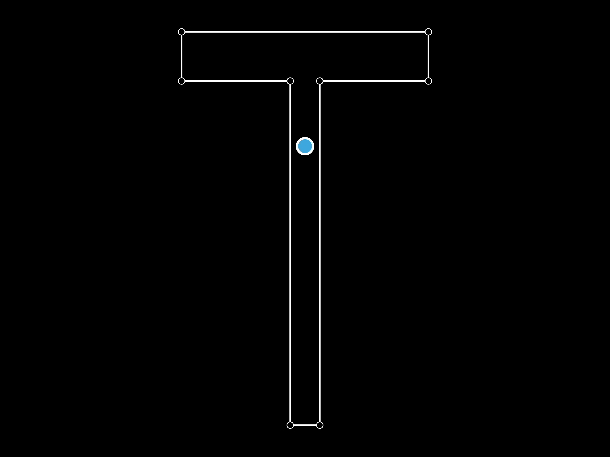

# AsapSections
Analysis of arbitrary polygonal cross sections.


# Usage
## `SolidSection`
Create a solid cross section (`SolidSection <: PolygonalSection`) via:

```julia
section = SolidSection(points::Vector{Vector{Float64}})
```

Where `points` is an *ordered* list of vertex positions, either clockwise or anti-clockwise

or

```julia
section = SolidSection(points::Matrix{Float64})
```

Where `points` is a [2 × n] matrix of vertex positions.

A `SolidSection` provides the following fields:
- points: a matrix of section vertex positions
- centroid: a vector of the centroid position
- area: cross section area
- Ix: second moment of area about X-axis situated at centroid
- Iy: second moment of area about Y-axis situated at centroid
- Sx: section modulus about X-axis
- Sy:section modulus about Y-axis
- xmin, xmax: extreme X-positions of section
- ymin, ymax: extreme Y-positions of section

E.g.:
```julia
#make a T section
flange_width = 250.
depth = 400.
flange_thickness = 50.
web_thickness = 30.

p1 = [0., 0.]
p2 = p1 + [flange_width, 0]
p3 = p2 - [0, flange_thickness]
p4 = p3 - [(flange_width - web_thickness) / 2, 0]
p5 = p4 - [0, depth - flange_thickness]
p6 = p5 - [web_thickness, 0]
p7 = p6 + [0, depth - flange_thickness]
p8 = p7 - [(flange_width - web_thickness) / 2, 0]

section_vertices = [
    p1,
    p2,
    p3,
    p4,
    p5,
    p6,
    p7,
    p8
]

section = SolidSection(section_vertices)
```



To reposition the vertices such that the centroid is at the origin, use:

```julia
center_at_centroid!(section::PolygonalSection)
```

## Analysis
### `depth_map`
Get a map of the cumulative area, `A`, enclosed by the original section at a horizontal line at depth `y` from the top of the section:

```julia
y, A = depth_map(section::AbstractPolygonalSection; n = 250)
```

Where `n` is the number of samples taken along the depth of the section.


### `depth_map_abs`
Get the values of cumulative area, `A`, enclosed at a series of absolute y positions in `y::Vector{Float64}`.

```julia
A = depth_map(section::AbstractPolygonalSection, y::Vector{Float64})
```

### `sutherland_hodgman`
Performs the [Sutherland-Hodgman Algorithm](https://en.wikipedia.org/wiki/Sutherland%E2%80%93Hodgman_algorithm) to get the vertices or a `Section` of the clipped geometry caused by a horizontal line at depth `y` from the top of the section:

```julia
clipped_vertices = sutherland_hodge(section::PolygonalSection, y::Float64)
clipped_section = sutherland_hodge(section::PolygonalSection, y::Float64; return_section = true)
```

`sutherland_hodge_abs` is also provided for an absolute value clipping line.

### `area_from_depth`
Get the area above a depth `depth` from the top of the section:

E.g.:
```julia
#area from depth
d = 150.
A_at_d = area_from_depth(section, d)
```


### `depth_from_area`
Get the depth required to enclose a target area `area`.

```julia
depth_from_area(section::AbstractPolygonalSection, area::Float64; max_iter = 500, rel_tol = 1e-3, show_stats = true)
```

This is an iterative process with a default maximum number of iterations of 500, and a relative stopping tolerance of 0.1%. `show_stats` outputs the total number of iterations and the final error of the solution.

E.g.:
```julia
#depth from area
Arequired = 4000.
d_at_A = depth_from_area(section, Arequired)
```

## `CompoundSection`
Create a compound section from multiple sections.

E.g.:
```julia
circle_radius = 5.
base1 = [-10., -350.]
base2 = [10., -350.]

n = 50

circle_pts_1 = [circle_radius .* [cos(thet), sin(thet)] .+ base1 for thet in range(0, 2pi, n)]
circle_pts_2 = [circle_radius .* [cos(thet), sin(thet)] .+ base2 for thet in range(0, 2pi, n)]

circle1 = SolidSection(circle_pts_1)
circle2 = SolidSection(circle_pts_2)

compound = CompoundSection([section, circle1, circle2])
```

All utility functions listed above also work for compound sections.

